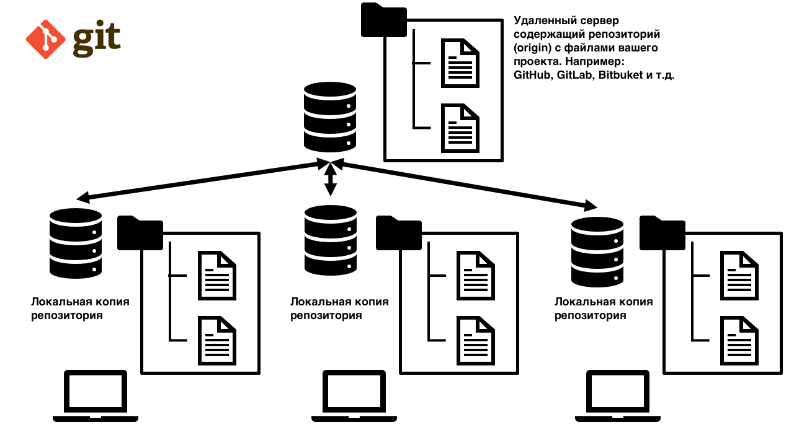

# Обретение смыслов:

- **GIT** - Распределенная система версий придуманая человеком легендой Linus Torvalds который придумал линукс, которым теперь все пользуются, большая часть серверов работает именно на линуксе, а потом GIT для разработки этого самого линукса.

Он придумал GIT для того чтобы над проектом могло работать большое количество людей не мешая при этом друг другу. Потому что когда над одним проектом работает 10 или 100 или 1000 человек и каждый разрабатывает какую-то свою часть то потом все эти изменения как-то нужно совмещать. Ситуация усугубляется когда два разработчика модифицируют одинаковые строки в одном и том же файле.

Представьте что вы разрабатываете какую-то новую фичу для этого вы себе локально скопировали актуальный проекта с удаленного сервера. Когда вы закончили разработку своей фичи то ваш локальный проект очень сильно отличается от проекта на удаленном сервере, потому что другие разработчики добавили туда кучу своих изменений. И теперь вопрос в задачнике как вам совместить вашу работу с изменениями которые сделали другие разработчики? Именно эту задачу и решает GIT.

**Распределенная система** - это когда есть какой-то удаленный сервер (т.е. не ваш локальный компьютер), обычно его называют origin например GitHub, GitLab, Bitbuket или свой личный сервер, на котором содержится репозиторий. И локальная версия этого проекта, копия (клон), у каждого разработчика. Изменения делаются локально и отправляются на удаленный сервер после чего становятся доступны другим разработчикам. Удаленный репозиторий - это как перевалочный пункт. Через который изменений должны пройти прежде чем станут доступны другим разработчикам.
  

**Репозиторий Git** — это хранилище файлов проекта.

**Cистема версий** - это программа ~~для удивительных путешествий во времени~~ позволяющая посмотреть как ваш проект выглядел год назад. Классический пример это хранение версий всего вашего проекта в директориях под названием проект-версия-1, проект-версия-2 и т.д. Но представьте что ваш проект занимает 1 Гб и при изменении 1 файла пришлось бы копировать 1 Гб в новую директорию. Система версий как-раз следит за тем чтоб этого не происходило и копировались и сохранялись в истории только те файлы или части файлов которые были изменены.