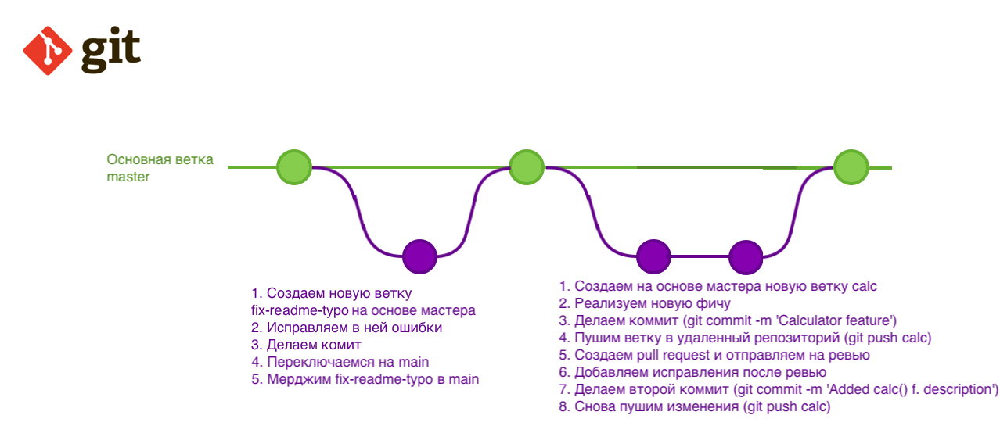

# Начинаем работать с GIT и удаленной репой (репозиторием)

Чтоб работать с `git` в конкретном проекте, нам нужно инициализировать `git`, это делается один раз, как правило в начале проекта.


## Инициализируем GIT:

Для этого в корне проекта выполним команду:

```
git init
```

При инициализации `git` создает скрытую директорию `.git` где хранит историю вашего проекта, посмотрим на нее:

```
ls -la
```


## Как поделится нашими изменениями?

Итак, мы создали файл README.md, потом проинициализировали GIT и теперь я хочу чтоб  данные изменения стали доступны другим разработчикам. Для этого мне нужно отправить 'посылочку' (commit) с моими изменениями на удаленный сервер (origin). Давайте создадим её.

Наш план действий:
1. Добавить изменения, которые будем фиксировать (commit), в промежуточную область (staging area).
2. Зафиксировать изменения (commit).
3. Отправить изменения на удаленный сервер (origin).


## Для начала посмотрим что происходит в нашем репозитории:

```
git status
```

Данная команда показывает актуальное состояние репозитория. И сейчас она нам говорит что 'Changes not staged for commit' т.е. есть изменения, не подготовленные для фиксации, подсвечивая наш файл красным.

Но прежде чем добавлять изменения для будущей фиксации, сделаем кое что другое, добавим в корне проекта файл `.gitignore`:

~/Projects/front-end-pro/.gitignore

```
# Web Storm directory
.idea

# Visual Studio directory
.vs

# Директория с модулями nodejs
node_modules
```

`.gitignore` - файл с указаниями какие файлы и директории GIT должен игнорировать. Например рабочие файлы IDE для нашего проекта, смысла шарить их с другими разработчиками нет, поэтому игнорируем их.

Полный список директорий для Visual Studio для `.gitignore` можно найти [вот тут](https://github.com/github/gitignore/blob/main/VisualStudio.gitignore).


## Добавление изменений в промежуточную область (to the staging area)

Все, теперь можно добавлять наши изменения для будущей фиксации, делается это с помощью команды:

```
git add .
```

Данная команда добавляет все изменения, в промежуточную область (to the staging area), которые мы хотим зафиксировать, кроме тех которые указаны в .gitignore. т.е. мы как будто говорим: `git`, я хочу добавить для будущей фиксации вот эти и эти изменения, а вот те изменения пока оставлю для доработки!'.

Обратите внимание точка означает: добавь для будущей фиксации все изменения. Точку проще написать чем перечислять названия всех файлов через пробел, будем ее использовать всегда.

Если нужно добавить прицельно один или несколько файлов, то их нужно перечислить через пробел, вот так:

```
git add README.md some-another-file.js
```

Посмотрим какое теперь состояние у нашего репозитория:

```
git status
```

Все, наш файл зелененький - теперь все изменения добавлены в промежуточную область для будущей фиксации.


## Зафиксируем (commit) изменения:

```
git commit -m "Initial commit"
```

Данная команда создает новый коммит - снимок изменений нашего проекта. Это как комар в янтаре. Вы не можете с ним ничего сделать но можете на него посмотреть с разных сторон и сравнить с другим комаром например :)


## Все, посылочка сформирована, давайте посмотри на нее повнимательнее:

```
git log
git log --oneline -n 3
```

Данная команда показывает историю коммитов (снимков изменений). Здесь есть дата когда были сделаны изменения, имя и почта автора чтоб можно было потом найти и заставить съесть этого комара в случае чего. И самое важное это уникальный идентификатор фиксации который нельзя поменять. Он нужен что бы ваш коммит не потерялся среди других коммитов т.е. снимков изменений.

Нет мы не на уроке по Энтомологии, просто пример с комаром показывает что вы никак не можете модифицировать коммит.

(!) Тут важно отметить что когда вы создаете первый коммит в проекте то `git` автоматически создает для вас новую ветку которая называется `master` или `main`, сейчас рекомендуется использовать название `main` для основной ветки.

**Ветка (branch) в `git`** - это последовательность коммитов.

Кружки - это последовательность коммитов, цвета показывают к каким веткам они пренадлежат.




## Отправим наши изменения на удаленный сервер (origin):

Сейчас все наши фиксации (commits) хранятся только локально и чтобы они стали доступны другим разработчикам мы должны отправить их на удаленный репозиторий откуда другие разработчики смогут их себе скачать. Выполним:

```
git push
```

Это команда отправляет наши изменения на удаленный репозиторий. Но первый раз она не сработает потому что мы не указали адрес куда отправлять коммиты, оно и не странно потому что адреса пока нет.


## [Создадим новый](https://github.com/new) чистый репозиторий с названием таким-же как и директория проекта и скопируем его адрес.

Теперь мы можем привязать локальный проект к удаленному репозиторию:

```
git remote add origin git@github.com:volodymyr-kryvoshapov/front-end-pro.git
```

Выполним снова команду

```
git push
```

И мы видим что `git` все еще ничего не отправил а выдал нам новое сообщение:

```
fatal: The current branch main has no upstream branch.
To push the current branch and set the remote as upstream, use

    git push --set-upstream origin main
```

Перевожу на язык понятный для простых смертных: 'да, я теперь знаю адрес репозитория куда отправлять изменения, и я вижу что ты свои изменения хранишь в локальной ветке main но я не в курсе в какую удаленную ветку ты хочешь отправить новые изменения. Может быть создать на удаленном сервере ветку с таким же названием как и на локальном сервере, связать локальную и удаленную ветки, и отправить изменения в нее?' Мы говори да, сделай это и выполняем команду которую предлагает `git`.

```
git push --set-upstream origin main
```

`git` говорит нам что локальная ветка 'main' настроена на отслеживание удаленной ветки 'main' из 'origin' (удаленного репозитория). Настройка связи между локальной и удаленной ветками делается один раз для каждой ветки при попытке пуша.

Переходим на наш репозиторий в github, обновляем страницу и видим нашу ветку, наш коммит и наш файл.